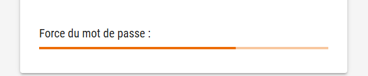

# Générateur de Mots de Passe Sécurisés


## Description

Bienvenue sur **Secure Password Generator**, une application web moderne et intuitive pour m'initier à la programmation d'applications.


## Fonctionnalités

- **Personnalisation de la Longueur** : Choisissez la longueur souhaitée pour votre mot de passe, de 1 à 64 caractères.
- **Options de Caractères** :
  - Inclure des lettres minuscules
  - Inclure des lettres majuscules
  - Inclure des chiffres
  - Inclure des symboles
- **Évaluation de la Force** : Visualisez la force de votre mot de passe en temps réel grâce à un indicateur visuel.
- **Copie Facile** : Copiez instantanément votre mot de passe généré dans le presse-papiers.
- **Sécurité Renforcée** : Utilisation de l'API `crypto` pour une génération de caractères aléatoires cryptographiquement sécurisée.

## Aperçu

### Options de Génération


### Indicateur de Force



## Installation

Suivez les étapes ci-dessous pour configurer et exécuter le projet localement.

### Prérequis

- [Node.js](https://nodejs.org/) (version 14 ou supérieure)
- [npm](https://www.npmjs.com/) (vient généralement avec Node.js)

### Étapes

1. **Cloner le Repository**

   ```bash
   git clone https://github.com/SofianeBel/CryptoKey.git
   cd CryptoKey
   ```

2. **Installer les Dépendances**

   ```bash
   npm install
   ```

3. **Démarrer l'Application**

   ```bash
   npm start
   ```

   Ouvrez [http://localhost:3000](http://localhost:3000) dans votre navigateur pour voir l'application en action.

## Utilisation

1. **Sélectionner la Longueur du Mot de Passe**  
   Utilisez le curseur pour définir la longueur désirée pour votre mot de passe.

2. **Choisir les Options de Caractères**  
   Activez ou désactivez les options pour inclure des minuscules, majuscules, chiffres et symboles.

3. **Générer le Mot de Passe**  
   Cliquez sur le bouton "Générer un nouveau mot de passe" pour créer un mot de passe basé sur vos préférences.

4. **Copier le Mot de Passe**  
   Utilisez le bouton "Copier le mot de passe" pour copier le mot de passe généré dans votre presse-papiers.

5. **Évaluer la Force**  
   Consultez l'indicateur de force pour assurer que votre mot de passe est suffisamment sécurisé.

## Technologies Utilisées

- [React](https://reactjs.org/)
- [Material-UI](https://mui.com/)
- [React Copy to Clipboard](https://github.com/nkbt/react-copy-to-clipboard)
- [React Testing Library](https://testing-library.com/docs/react-testing-library/intro/)

## Tests

Des tests unitaires sont inclus pour assurer la fiabilité des composants principaux.

Pour exécuter les tests, utilisez la commande suivante :

```bash
npm test
```

## Contribution

Les contributions sont les bienvenues ! Pour contribuer, veuillez suivre les étapes suivantes :

1. **Forker le Repository**
2. **Créer une Branche de Fonctionnalité**

   ```bash
   git checkout -b fonctionnalite/nom-de-la-fonctionnalite
   ```

3. **Committer Vos Changements**

   ```bash
   git commit -m "Ajout de la fonctionnalité XYZ"
   ```

4. **Pousser la Branche**

   ```bash
   git push origin fonctionnalite/nom-de-la-fonctionnalite
   ```

5. **Ouvrir une Pull Request**

Assurez-vous que vos contributions respectent les normes de codage et sont bien testées.

## Licence

Ce projet est sous licence [MIT](LICENSE).

## Auteurs

- **SIFLY**

## Remerciements

- Merci à la communauté Open Source pour les outils et bibliothèques utilisés dans ce projet.
- [Create React App](https://create-react-app.dev/)
- [Material-UI](https://mui.com/)

---

# Secure Password Generator


## Description

Welcome to **Secure Password Generator**, a modern and intuitive web application to introduce me to application programming.


## Features

- **Length Customization**: Choose the desired length for your password, from 1 to 64 characters.
- **Character Options**:
  - Include lowercase letters
  - Include uppercase letters
  - Include numbers
  - Include symbols
- **Strength Evaluation**: Visualize your password strength in real-time with a visual indicator.
- **Easy Copy**: Instantly copy your generated password to the clipboard.
- **Enhanced Security**: Utilizes the `crypto` API for cryptographically secure random character generation.

## Preview

### Generation Options


### Strength Indicator


## Installation

Follow the steps below to set up and run the project locally.

### Prerequisites

- [Node.js](https://nodejs.org/) (version 14 or higher)
- [npm](https://www.npmjs.com/) (usually comes with Node.js)

### Steps

1. **Clone the Repository**

   ```bash
   git clone https://github.com/SofianeBel/CryptoKey.git
   cd CryptoKey
   ```

2. **Install Dependencies**

   ```bash
   npm install
   ```

3. **Start the Application**

   ```bash
   npm start
   ```

   Open [http://localhost:3000](http://localhost:3000) in your browser to view the application in action.

## Usage

1. **Select Password Length**  
   Use the slider to set the desired length for your password.

2. **Choose Character Options**  
   Toggle the switches to include lowercase, uppercase, numbers, and symbols.

3. **Generate Password**  
   Click the "Generate New Password" button to create a password based on your preferences.

4. **Copy Password**  
   Use the "Copy Password" button to copy the generated password to your clipboard.

5. **Evaluate Strength**  
   Check the strength indicator to ensure your password is sufficiently secure.

## Technologies Used

- [React](https://reactjs.org/)
- [Material-UI](https://mui.com/)
- [React Copy to Clipboard](https://github.com/nkbt/react-copy-to-clipboard)
- [React Testing Library](https://testing-library.com/docs/react-testing-library/intro/)

## Tests

Unit tests are included to ensure the reliability of the main components.

To run the tests, use the following command:

```bash
npm test
```

## Contribution

Contributions are welcome! To contribute, please follow these steps:

1. **Fork the Repository**
2. **Create a Feature Branch**

   ```bash
   git checkout -b feature/feature-name
   ```

3. **Commit Your Changes**

   ```bash
   git commit -m "Add XYZ feature"
   ```

4. **Push the Branch**

   ```bash
   git push origin feature/feature-name
   ```

5. **Open a Pull Request**

Ensure your contributions adhere to coding standards and are well-tested.

## License

This project is licensed under the [MIT License](LICENSE).

## Authors

- **SIFLY**

## Acknowledgments

- Thanks to the Open Source community for the tools and libraries used in this project.
- [Create React App](https://create-react-app.dev/)
- [Material-UI](https://mui.com/)
